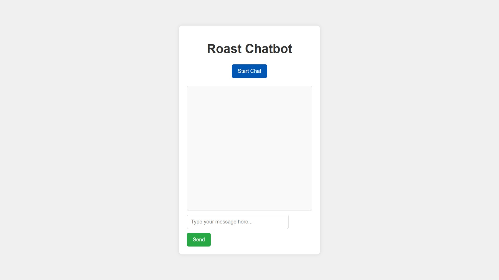
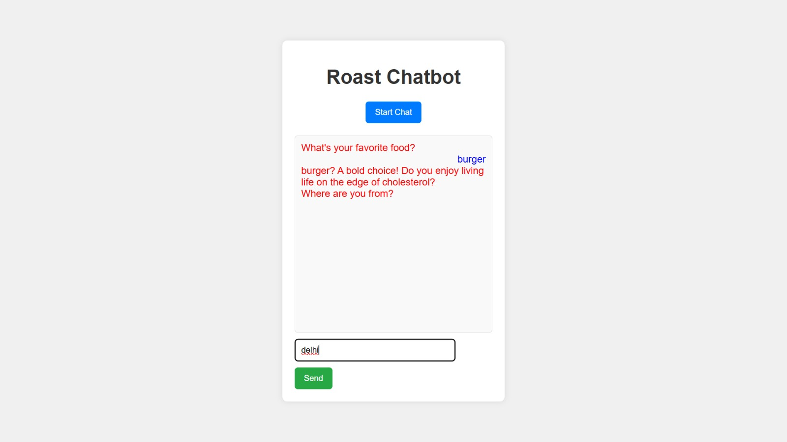
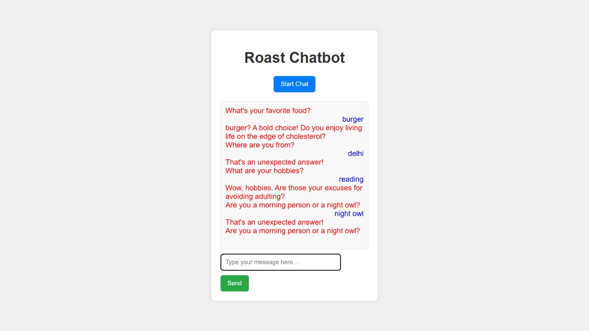

# Roasting Bot 🎯
[Hosted Link]( https://anami04.github.io/Roast_Bot/)

## Basic Details
### Team Name: Aspire

### Team Members
- Team Lead: Anamika C- GCEK
- Member 2: Thejas M - GCEK
- Member 3: Sruti Ganga- GCEK

### Project Description
The **Roast Chatbot** is an interactive web application that engages users in humorous conversations by delivering personalized roasts based on their quirky answers. Built with JavaScript, HTML, and CSS, it features a smooth conversational flow and a user-friendly design. Users enjoy a fun experience as the chatbot dynamically generates witty responses, making it a light-hearted entertainment tool. Future enhancements may include machine learning for tailored responses and expanded language support.

### The Problem (that doesn't exist)
In a world saturated with overly serious conversations and mundane chatbots, the **Roast Chatbot** addresses the *ridiculous problem* of insufficient laughter in online interactions. Users are plagued by dull exchanges, leaving them craving humor and lighthearted banter. This chatbot boldly steps in to alleviate the absurdity of serious chat experiences by providing personalized roasts, ensuring users are both entertained and slightly offended in the best possible way. By transforming ordinary chats into hilarious roasts, the Roast Chatbot solves the imaginary crisis of joylessness in digital communication, one quip at a time!

### The Solution (that nobody asked for)
Introducing the **Roast Chatbot**, the uninvited jester of online conversations! This app hilariously transforms boring chats into comedy gold by serving up personalized roasts based on user responses. It asks ridiculous questions like, “What’s your favorite food that nobody else should ever try?” and follows up with a perfectly timed roast that leaves users laughing (or groaning). Instead of tackling serious issues, the Roast Chatbot brings joy back into digital interactions, proving that life’s too short not to have a little fun!

## Technical Details
For Software:
- Languages used-HTML,CSS,js

### Implementation
For Software:
1. **Setup Development Environment**
2. **Project Structure**
3. **HTML**
4. **CSS**
5. **JavaScript**
6. **Testing**
7. **Deployment**
# Installation
git clone <repository-url>
cd <project-directory>

# Run
cd <project-directory>
live-server

### Project Documentation
For Software:
The Roast Chatbot provides a comprehensive overview of the application, detailing its purpose and features. It includes installation instructions for setting up the environment and running the application, along with usage guidelines for user interaction. The documentation highlights the technologies used, such as frameworks and libraries, and outlines the implementation process, covering project structure and key components. Additionally, it discusses testing methods, future enhancement suggestions, licensing information, and acknowledges contributors to the project, ensuring clarity and accessibility for users and developers alike.

# Screenshots 
Screenshot 1- Opening Window

Screenshot2 - On clicking start button bot will start asking questions 

Screenshot 3 - When the user answers it , bot will give roasting  comments

# Video
<video width="320" height="240" controls>
  <source src="record_000001.mp4" type="video/mp4">
</video>

